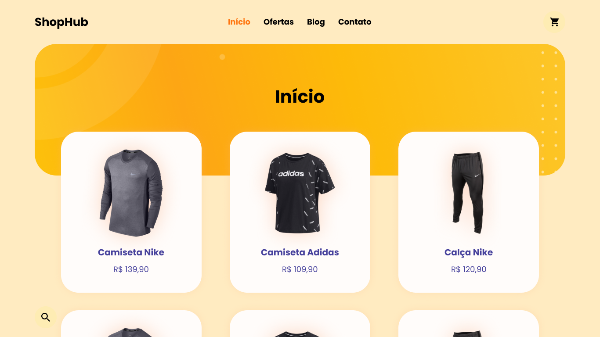

_English_

# ShopHub

👕 A small store with some registered products that I made to exercise my new knowledge with nextjs.

`Web preview`

## 🕹 Deployment in
https://shophub.vercel.app

## 🗃 Release history

* 0.0.1
    * Work in progress

## 📝 Meta

Gabriel de Jesus – [My portfolio](https://www.gabrieldesenvolvedor.com) – oi@gabrieldesenvolvedor.com

Distributed under the MIT License. See `LICENSE` for more information.

[https://github.com/devgabrieldejesus/shophub](https://github.com/devgabrieldejesus/)

## 🚀 Contributing

1. Fork it (<https://github.com/devgabrieldejesus/shophub/fork>)
2. Create your feature branch (`git checkout -b feature/fooBar`)
3. Commit your changes (`git commit -am 'Add some fooBar'`)
4. Push to the branch (`git push origin feature/fooBar`)
5. Create a new Pull Request

---

_Português_

# ShopHub

👕 Uma pequena loja com alguns produtos cadastrados que fiz para exercitar meus novos conhecimentos com o nextjs.

`Visualização da Web`

## 🕹 Teste aqui
https://shophub.vercel.app

## 🗃 Histórico de lançamento

* 0.0.1
  * Trabalho em progresso

## 📝 Meta

Gabriel de Jesus - [Meu portfólio](https://www.gabrieldesenvolvedor.com) - oi@gabrieldesenvolvedor.com

Distribuído sob a licença MIT. Veja `LICENSE` para mais informações.

[https://github.com/devgabrieldejesus/shophub](https://github.com/devgabrieldejesus/)

## 🚀 Contribuição

1. Fork it (<https://github.com/devgabrieldejesus/shophub/fork>)
2. Crie seu branch de recurso (`git checkout -b feature / fooBar`)
3. Faça commit de suas alterações (`git commit -am 'Add some fooBar'`)
4. Empurre para o branch (`git push origin feature / fooBar`)
5. Crie uma nova solicitação pull
